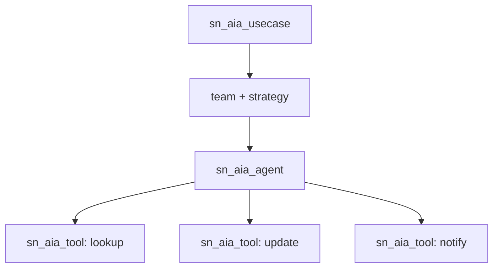
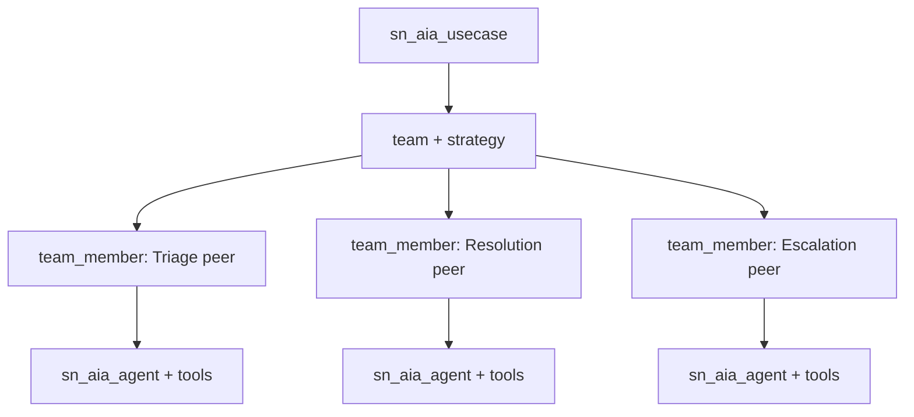
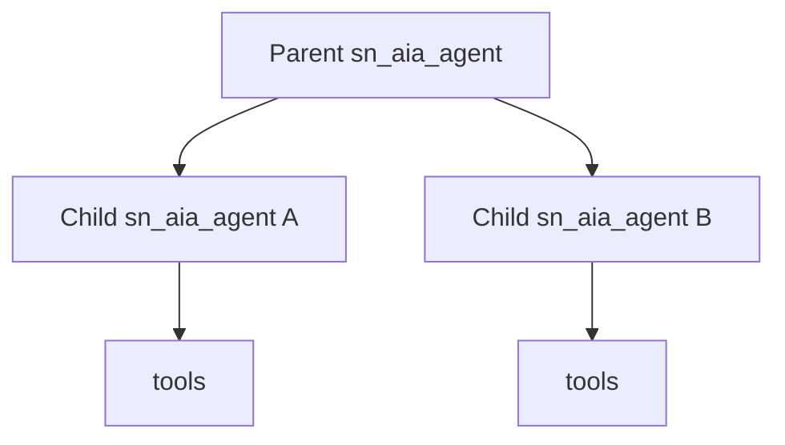
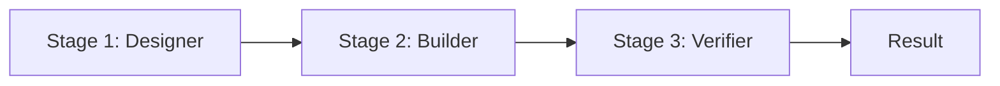
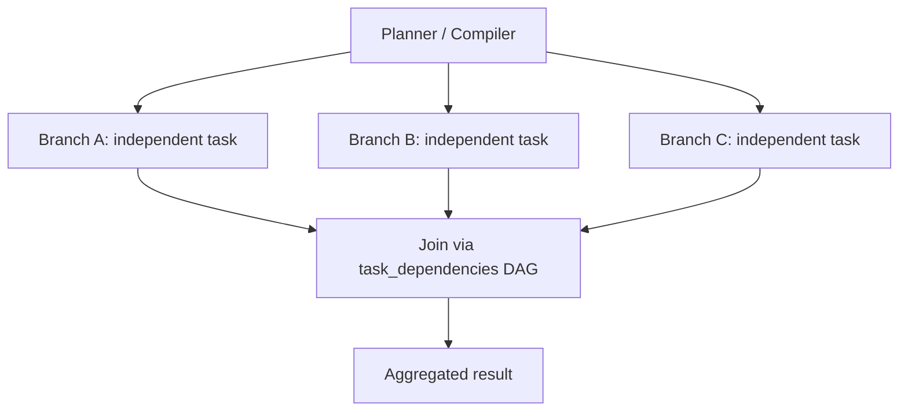
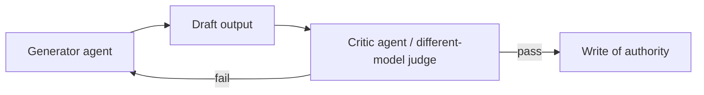

# Multi-Agent Coordination Patterns — ServiceNow Zurich

> The coordination shapes the Now Assist AI Agents platform genuinely supports, mapped to the live `sn_aia` data model. Pick the **simplest topology the platform supports** for the job — most use cases need far less structure than builders assume.

> **Live-verified facts** in this doc come from the gpinst01 instance (Zurich Patch 8). Anything not verified is marked "(confirm on instance during build)". All underlying property/topology/API doc-correctness is owned by the keystone ticket **#107** — this doc does not re-state or re-fix it.

---

## Topology Primer

A Now Assist use case is **not** a hand-coded orchestrator dispatching to children. The platform owns the coordination shape:

```
sn_aia_usecase                 one use case
    └── team  (sn_aia_team)        one team + one strategy
            └── sn_aia_team_member   flat agent PEERS (no order field)
                    └── sn_aia_agent
                            └── agent-tool m2m
                                    └── sn_aia_tool   (~1110 tool rows live)
```

Key points:

- **A use case maps to one team + one strategy.** There is no `sn_aia_usecase.orchestrator_agent` field — the platform does not model an orchestrator as a use-case attribute.
- **`sn_aia_team_member` rows are flat peers.** There is no order/sequence column on the member record; agents on a team are coordinated by the platform **strategy**, not by a builder-defined dispatch tree.
- **Agents bind to tools through an agent-tool m2m**, and tools (`sn_aia_tool`) are the unit of capability. The bulk of the data layer (~1110 tool rows) is tools, not agent hierarchy.

### When to add hierarchy

`sn_aia_agent_child` exists for genuine parent/child delegation, but it is a **deliberate opt-in, not the default** — only ~3 rows are live on the instance. Add it only when you need real delegation depth (a parent agent that dispatches to a specialist child as a distinct reasoning context). For most use cases, a single agent or a team of peers is the correct shape.

### How this differs from a hand-coded orchestrator

The builder configures **instructions, tools, and strategy**. The reasoning loop itself is **platform-run ReAct** — you do not hand-code the dispatch/observe/act loop:

- `sn_aia_strategy` is read-only; ~291 of 313 agents run on ReAct.
- Reasoning steps land in `sn_aia_execution_task` (the literal `"Thought"` key appears in task records).
- Loop safety is governed by editable platform limits, not a builder-authored loop counter:
  - `sn_aia.continuous_tool_execution_limit` = 25 (developer-**editable**)
  - `sn_aia.react_failure_retry_max_limit` = 3

There is no `sn_aia.max_iterations` property — do not configure or reference one.

### Models are per-capability-definition

Models are bound **per One Extend capability definition** (`sys_one_extend_capability_definition.connection`, a GenAI alias) — the `sys_one_extend_capability` table itself has no model field. There is no single instance-wide model and no `sn_aia.agent_llm_provider` property. Because binding is per-definition, a **different-model** judge/critic is achievable (see Pattern 6, and #83 / #92).

### Memory

- `sn_aia_memory` is real and populated; storage is **plain text** (no vector storage).
- `memory_scope` is per `sn_aia_team_member` — a first-class, per-agent setting.
- `context_sharing_strategy = summarise` is a **strategy** property (not a per-agent field).

### Trace / debug

Coordination is observable via `sn_aia_execution_plan` / `sn_aia_execution_task`, and through the MCP `servicenow_aia_trace` tool.

---

## Supported Coordination Patterns

Each pattern below maps to a real `sn_aia` shape. Start at the top and only move down when the simpler pattern cannot express the problem.

### 1. Single agent + tools

The right default for the large majority of use cases: one `sn_aia_agent` with a set of `sn_aia_tool` scripts, running the platform ReAct loop.



**When to use:** the task is one coherent job — classify, look up, summarize, update — that a single reasoning context with a handful of tools can complete. If you cannot name a failure mode that a second agent prevents, stay here.

### 2. Team of peer agents

Multiple `sn_aia_team_member` agents under one team, coordinated by the platform strategy. This is the **native multi-agent shape** — flat peers, not an orchestrator tree.



**When to use:** the use case spans distinct specialist roles that benefit from separate instruction sets, tool sets, or `memory_scope`, and the platform strategy can coordinate them as peers. Prefer this over building explicit hierarchy.

### 3. Parent/child hierarchy

Opt-in `sn_aia_agent_child` relationships for genuine delegation depth — a parent agent that hands a sub-task to a child agent as a distinct reasoning context.



**When to use:** only when a peer team cannot express the relationship — i.e., you need a parent to delegate to a child as a nested, separately-reasoning unit. This is rare on the live platform (~3 `sn_aia_agent_child` rows); do not reach for it by default.

### 4. Sequential pipeline

Ordered hand-offs, where step N's output feeds step N+1. Because `sn_aia_team_member` has **no order field**, sequencing is not expressed on the member record — it is expressed via Flow Designer (chained agent steps) or via the team strategy.



**When to use:** the work has a fixed, ordered set of stages with no routing decision (so a supervisor LLM call would be wasted). Express the ordering through a Flow or the strategy. (Confirm the exact ordering mechanism — Flow chaining vs strategy-ordered work — on instance during build.)

### 5. Native parallelism

Independent sub-tasks run concurrently using the platform's native primitives — **not** a Flow-only workaround. The live instance ships:

- `sn_aia.agent_parallel_tool_execution.enabled` = true
- Swarm Planner
- LLM Compiler
- `sn_aia_execution_task.task_dependencies` (a DAG)



**When to use:** the work decomposes into sub-tasks with no inter-dependency that can run at the same time to cut latency, with a join step that depends on all branches. (Confirm which primitive — parallel tool execution, Swarm Planner, LLM Compiler, or an explicit `task_dependencies` DAG — fits the use case on instance during build.)

### 6. Generator + critic

A critic agent reviews a generator agent's output before it is committed. The critic can be a peer (Pattern 2) or a child (Pattern 3). Because models bind **per One Extend capability definition** (`sys_one_extend_capability_definition.connection`), the critic can run on a **different model** than the generator — a deterministic check against the generator's blind spots.



**When to use:** before any irreversible or record-of-authority action, where a single-inference write is too risky. The different-model judge pattern is detailed in **#83** (Generate-then-Verify) and **#92** (different-model judge).

---

## Decision Table

Pick the simplest pattern whose row matches your problem shape. (Supported patterns only.)

| Problem shape | Recommended pattern |
|---|---|
| One coherent job, a handful of tools, no named second-agent failure mode | **1. Single agent + tools** |
| Distinct specialist roles coordinated by the platform strategy | **2. Team of peer agents** |
| A parent must delegate to a nested, separately-reasoning child | **3. Parent/child hierarchy** (opt-in; rare) |
| Fixed ordered stages, no routing decision | **4. Sequential pipeline** (Flow/strategy ordering) |
| Independent sub-tasks that can run concurrently to cut latency | **5. Native parallelism** (parallel tool exec / Swarm Planner / LLM Compiler / `task_dependencies`) |
| A write of authority that needs review before commit | **6. Generator + critic** (different-model judge achievable) |

---

## Start Simple

Every agent, team member, and LLM call should earn its place by preventing a failure mode you can **name**. The default is Pattern 1 (single agent + tools); move down the patterns only when the simpler shape genuinely cannot express the problem.

The full start-simple discipline — the design-validation checklist, the anti-pattern catalog ("more agents = better", symmetric multi-agent, building a supervisor when routing is fixed), and the rule-of-thumb that gates each addition — lives in the **Agentic Workflow Builder** skill and is owned by **#91**. This doc does not duplicate it; apply that discipline when choosing among the patterns above.

See: [`skills/agentic-workflow-builder/SKILL.md`](../skills/agentic-workflow-builder/SKILL.md) — Single-Agent vs Multi-Agent, Design Validation Checklist, and Anti-Patterns.

---

## Related Resources

- [Agentic Patterns](./agentic-patterns.md) — orchestration strategies and memory architecture
- [Multi-Agent Handoff Patterns](./multi-agent-handoff-patterns.md) — context sharing, failure propagation, result aggregation
- [ServiceNow AI Data Model](./servicenow-ai-data-model.md) — `sn_aia` tables and execution records
- [ServiceNow AI System Properties](./servicenow-ai-system-properties.md) — loop limits and memory properties
- `skills/agentic-workflow-builder/SKILL.md` — start-simple discipline and architecture decisions (#91)

---

*Coordination patterns mapped to the live `sn_aia` topology (gpinst01, Zurich Patch 8). Doc-correctness for the underlying properties/topology is owned by #107.*
