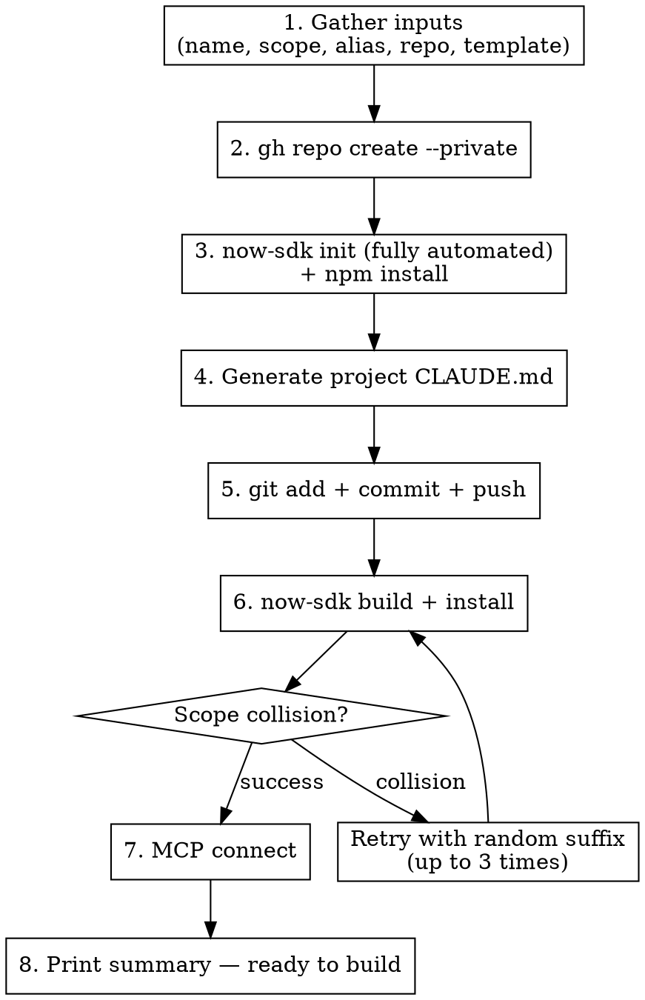

# Bootstrap Now SDK

Set up a ServiceNow SDK scoped app project (>= 4.7.0; validated on 4.8.1/4.9.0) — GitHub repo, now-sdk init, project CLAUDE.md, git, build, install, MCP connect.

> **Runtime tooling:** The `servicenow_*` tool names in this document are the Foundry MCP server's runtime tools. Treat them as capabilities — "execute an agent", "read an execution trace", "query a table" — and map them to the equivalents of whatever MCP server is connected. With no MCP server, fall back to manual verification: test in the Now Assist panel / AI Agent Studio and read execution traces from `sn_aia_execution_plan` / `sn_aia_execution_task`; query data via list views or a user-run background script.

**Prerequisite:** `foundry_init` must have already run (provides this skill, context files, and sdk-examples).

**VALIDATED:** Full end-to-end bootstrap tested 2026-04-01 against SDK 4.5.0 / keynexus01; golden-example suite re-build-validated against SDK 4.8.1 and 4.9.0 on 2026-07-17 (issue #191).

## When to Use

- After `foundry_init` — to set up the SDK project, repo, and deploy to instance
- Starting a new customer POC engagement
- Need a portable, version-controlled ServiceNow app

## Prerequisites

`foundry_init` must have already run in this directory (it provides this skill).

Additionally verify:

```bash
now-sdk --version    # >= 4.7.0 (AI-agent examples use the 4.7.0 'search_retrieval' tool type)
node --version       # >= v20.18.0
gh --version         # GitHub CLI, authenticated
git --version        # Git configured with user.name/email
now-sdk auth --list  # Must show your target instance alias
```

If auth is missing, the user must run `now-sdk auth --add <alias>` interactively first (cannot be automated).

### One-Time Machine Setup (Recommended)

Install ServiceNow's official AI coding skills so the AI assistant has live access to SDK docs and environment verification. **One-time per machine — not per-project.** Run these slash commands inside the Claude Code session:

```
/plugin marketplace add servicenow/sdk
/plugin install fluent
/reload-plugins
```

This installs:
- **`now-sdk-explain`** — on-demand live SDK docs (real-time API signatures, naming conventions, platform patterns from the installed SDK version, not training data)
- **`now-sdk-setup`** — environment verification (Node.js 20+, `@servicenow/sdk` v4.7.0+)

Cursor users: loading the skills into Claude Code lets Cursor use them too. Codex / Kiro / others — see [Discussion #47](https://github.com/ServiceNow/sdk/discussions/47) for installer commands per-tool.

Verify after install: ask the assistant `now-sdk explain --list` — if topics are listed, the skill is active.

## The Process



### Step 1: Gather Inputs

Ask the user for these values using AskUserQuestion. Suggest defaults where possible.

| Input | Example | Default / Auto | Notes |
|-------|---------|----------------|-------|
| **Project name** | "Acme Incident Triage" | — | Human-readable |
| **Scope** | `x_snc_acme_triage` | Auto-generate from name | Must be unique, max 18 chars |
| **Instance alias** | `keynexus01` | From `now-sdk auth --list` | Must match configured auth |
| **GitHub repo name** | `tool-acme-triage-poc` | `tool-<customer>-<usecase>-poc` | Convention |
| **Template** | `typescript.basic` | `typescript.basic` | Or `typescript.react` if UI needed |
| **Use case summary** | "3 agents for incident triage" | — | Used in CLAUDE.md |
| **GitHub visibility** | `--private` | `--private` | Default private for customer POCs |

### Step 2: Create GitHub Repo and Working Directory

```bash
# Create repo on GitHub
gh repo create <repo-name> --private

# Create local directory and cd into it
mkdir <repo-name> && cd <repo-name>
```

### Step 3: Initialize SDK App (Fully Automated)

**IMPORTANT:** `now-sdk init` supports full CLI automation — no interactive prompts needed.

```bash
now-sdk init \
  --appName "<project_name>" \
  --packageName "<package-name>" \
  --scopeName "<scope>" \
  --template "<template>" \
  --auth <alias>
```

**Required flags:**
- `--appName` — Display name (e.g., "Acme Incident Triage")
- `--packageName` — npm-style name, lowercase with hyphens (e.g., "x-snc-acme-triage")
- `--scopeName` — ServiceNow scope (e.g., "x_snc_acme_triage")
- `--template` — One of: `typescript.basic` (default, no UI) or `typescript.react` (with React UI)
- `--auth` — Instance alias from `now-sdk auth --list`

**If any flag is missing, the CLI will prompt interactively — provide ALL flags.**

Then install dependencies:
```bash
npm install
```

**Scope naming rules:**
- Must start with `x_snc_` (ServiceNow internal) or `x_` (ISV)
- Max 18 characters total
- Lowercase letters, numbers, underscores only
- Must be globally unique across ALL ServiceNow instances

**Scope auto-generation from project name:**
1. Take customer short name + use case short name
2. Lowercase, replace spaces/hyphens with underscores
3. Prefix with `x_snc_`
4. Truncate to 18 chars
5. Example: "Acme Incident Triage" → `x_snc_acme_triage`

### Step 4: Generate Project CLAUDE.md

The SDK context files (`sdk-reference.md` + `sdk-examples/`) are already in `.claude/context/` from `foundry_init` (MCP) or the `foundry:foundry-init` skill (plugin). Generate the project-specific `CLAUDE.md` at the project root, replacing ALL `<placeholders>` with actual values:

```markdown
# <Project Name> — ServiceNow SDK POC

## Project
- **Scope:** <scope>
- **PDI (dev/test):** <alias> → https://<instance>.service-now.com
- **POC instance:** (add when provisioned — customer data instance)
- **Use case:** <use_case_summary>

## SDK Context (always loaded)
@.claude/context/sdk-reference.md

## Project Structure
- `src/fluent/` — Fluent DSL definitions (agents, tables, flows, etc.) — **edit here**
- `src/client/` — React frontend code (only present with typescript.react template)
- `src/server/` — Server-side TypeScript modules
- `dist/` — Compiled output — **never edit** (generated by `now-sdk build`)
- `.claude/context/sdk-examples/` — 39 build-validated golden examples to pattern-match from
- `.claude/context/sdk-reference.md` — Build rules + composition patterns + Golden Example Index (40 rules; loaded above via @)

## Live API Docs

For current API signatures, parameter names, and platform patterns, run `now-sdk explain <topic>` — pulls from the installed SDK version, not training data. Use this **first** when stuck on an unfamiliar API; pattern-match against the golden examples second.

```
now-sdk explain --list                 # Browse all topics
now-sdk explain <topic>                # Open the full doc
now-sdk explain <topic> --peek         # Brief summary without the full doc
now-sdk explain <topic> --format=raw   # Raw markdown
```

If the `now-sdk-explain` skill is loaded (installed via `/plugin install fluent`), Claude / Cursor / Codex / Kiro use these automatically — no manual invocation needed.

## How to Build Anything

1. **Ask clarifying questions first** — use AskUserQuestion before implementing. Do NOT guess.
2. **Find the API** — check the Golden Example Index in sdk-reference.md, or run `now-sdk explain --list` / `now-sdk explain <topic>` for live API specs
3. **Read the golden example** — `.claude/context/sdk-examples/<api>.now.ts` has build-validated patterns
4. **Write Fluent DSL** in `src/fluent/` — follow the example patterns exactly
5. **Build and deploy** — `now-sdk build && now-sdk install --alias <alias>`
6. **Verify on instance** — check the URL printed by install
7. **Commit to feature branch** — never commit to main directly

**Critical Fluent DSL rules** (full list in sdk-reference.md):
- Every `.now.ts` file MUST start with `import '@servicenow/sdk/global'`
- `TemplateValue`, `Duration`, `Time`, `FieldList` are globals — do NOT import them
- Table export name must match table name: `export const x_snc_myapp_table = Table({...})`
- No shorthand properties (`{ x }`) or ternaries in Fluent files
- Script tool scripts MUST be self-invoking IIFEs: `(function(inputs) { ... })(inputs);` — missing `(inputs)` causes runtime "Error while converting object to JSON"
- RAG tools are `type: 'search_retrieval'` (SDK 4.7.0+) with typed structured `inputs`, mandatory at build — no cast; `toolAttributes` does NOT work for RAG config (see rule #20)
- `now-sdk build` must succeed before `now-sdk install`

## Agent Development Mode

**SDK owns creation.** Agents, skills, workflows, tables, flows — all defined as
Fluent DSL in `src/fluent/`, version-controlled, deployed via build + install.

**MCP owns runtime.** Execute agents, read logs, trace failures, test skills, query data.

| Task | Tool |
|------|------|
| Create/modify agent, skill, flow, table | Edit `.now.ts` → `now-sdk build` → `now-sdk install --alias <alias>` |
| Test agent | `aia_execute` (MCP) |
| Debug agent | `aia_logs`, `aia_trace`, `aia_errors` (MCP) |
| Test skill | `skill_execute` (MCP) |
| Query instance | `servicenow_query`, `servicenow_script` (MCP) |
| Quick prototype (temporary) | `aia_create` (MCP) — **must port to Fluent DSL before session ends** |

### MCP Prototyping Guardrail
If you use MCP to create/modify an agent or skill:
1. It MUST be ported to Fluent DSL in `src/fluent/` before the session ends
2. **Never** modify via MCP anything that already exists in `src/fluent/`

## Key Commands

```
now-sdk build                          # Compile src/ → dist/ (required before install)
now-sdk install --alias <alias>        # Deploy dist/ to instance
now-sdk download src/                  # Pull from instance (only if instance-side edits)
now-sdk explain <topic>                # Live API docs — see "Live API Docs" section above
now-sdk dev                            # Local dev server with hot reload (React UI projects)
```

Never commit `dist/`, `.snc/`, or credentials.

## Git Workflow

**NEVER commit directly to main.** All changes require a branch and PR.

Branch naming: `feature/`, `fix/`, `chore/`, `docs/`

```
git checkout -b feature/<description>
# make changes, build, install, verify
git add src/
git commit -m "feat: <description>"
git push -u origin feature/<description>
gh pr create
```

## Prompting Discipline

**Do NOT build on insufficient information.** Before implementing anything, use
AskUserQuestion to clarify: purpose, inputs, outputs, edge cases.

Only skip when the user says "just build it" or provides detailed specs.
```

### Step 5: Git Setup

```bash
# Ensure .gitignore covers everything (now-sdk init creates a basic one — extend it)
cat >> .gitignore << 'EOF'
.snc/
*.log
.env
.DS_Store
EOF

# Init git, commit, wire remote, push
git init
git add -A
git commit -m "feat: bootstrap POC project — <project_name>

ServiceNow SDK scoped app with Claude Code context for Fluent DSL development.
Scope: <scope>
Use case: <use_case_summary>"

git remote add origin https://github.com/<user>/<repo-name>.git
git branch -M main
git push -u origin main
```

### Step 6: Build and Deploy

```bash
now-sdk build
now-sdk install --alias <alias>
```

On success, `now-sdk install` prints a URL to the app on the instance.

**Scope collision handling:** If install fails with a scope conflict:
1. Generate a random 2-digit suffix (10-99)
2. Append to scope: `x_snc_acme_tri_42`
3. Update scope in `now.config.json`
4. Rebuild and reinstall
5. Repeat up to 3 times, then ask user to choose manually

**Auth failure:** Prompt user to run `! now-sdk auth --add <alias>` (interactive).

### Step 7: Connect MCP for Runtime

After successful install, connect the MCP server to the instance so runtime tools are ready:

```
Use mcp__foundry__servicenow_connect with:
  instance: <instance>.service-now.com
  authType: keychain (or basic)
  username: <username>
```

This enables `aia_execute`, `aia_logs`, `aia_trace`, `skill_execute`, and all other runtime MCP tools.

### Step 8: Print Summary

```
POC project "<project_name>" is ready.

  Repo:     https://github.com/<user>/<repo-name>
  Scope:    <scope>
  Instance: <alias> (https://<instance>.service-now.com)
  App URL:  <url from install output>

Context loaded:
  - SDK build rules + composition patterns + golden example index (40 rules)
  - 39 build-validated golden Fluent DSL examples
  - Foundry skills and context
  - Live SDK docs via `now-sdk explain` (and `now-sdk-explain` skill if installed)

Next steps:
  - "Build me an incident triage agent with 3 tools"
  - "Create a flow that auto-assigns P1 incidents"
  - "Add a custom table for agent configurations"

For runtime testing (execute agents, read logs, trace errors):
  - Connect MCP: servicenow_connect
  - Then use aia_execute, aia_logs, aia_trace
```

## Template Selection Guide

| Template | When to Use |
|----------|-------------|
| `typescript.basic` | Agents, skills, flows, tables — no UI **(default)** |
| `typescript.react` | Need a React UI page (dashboards, custom forms) |

> **Why only TypeScript?** All golden examples, context files, and server modules are TypeScript.
> Fluent DSL (`src/fluent/`) is always `.now.ts` regardless of template. JavaScript templates
> create a mismatch with the entire context library and offer no benefit.

## Common Mistakes

| Mistake | Fix |
|---------|-----|
| Scope collision on install | Append random 2-digit suffix, update now.config.json, retry |
| `now-sdk auth` not configured | User must run `now-sdk auth --add <alias>` interactively |
| Forgot `npm install` after init | Build will fail — always run npm install after now-sdk init |
| Committed dist/ or .snc/ | Add to .gitignore before first commit |
| Wrong instance alias | Check `now-sdk auth --list` and match exactly |
| Missing `--packageName` flag | `now-sdk init` will prompt interactively — provide all flags |
| SDK < 4.6.0 | AiAgent, AiAgenticWorkflow, NowAssistSkillConfig (with auto-ACL/outputs), Form, InboundEmailAction, expanded NASK input types, and Custom Action authoring require 4.6.0 |
| SDK < 4.7.0 | The `search_retrieval` AiAgent tool type requires 4.7.0 — `type: 'rag'` was renamed in 4.7.0 and no longer type-checks (golden examples target 4.7.0+) |

## Scope Naming Convention

```
x_snc_<customer_short>_<usecase_short>
```

Examples:
- `x_snc_acme_triage` — Acme incident triage
- `x_snc_contoso_hr` — Contoso HR service delivery
- `x_snc_fabrik_itsm` — Fabrikam ITSM automation

If collision: `x_snc_acme_tri_42` (append random 2-digit suffix)

Max 18 characters total. Keep it short.
